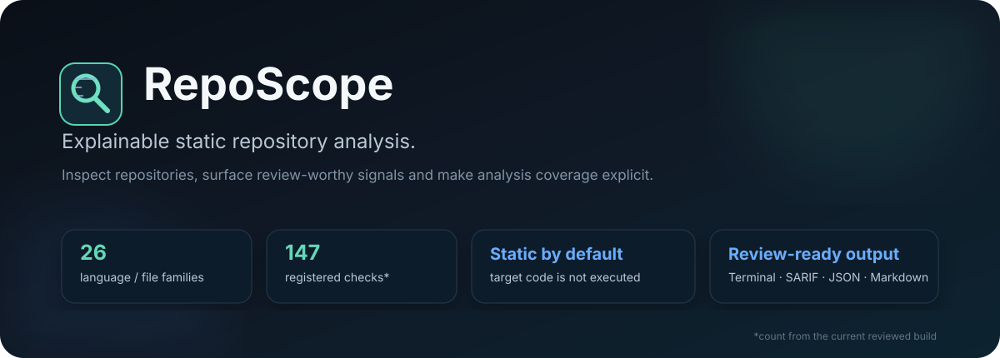
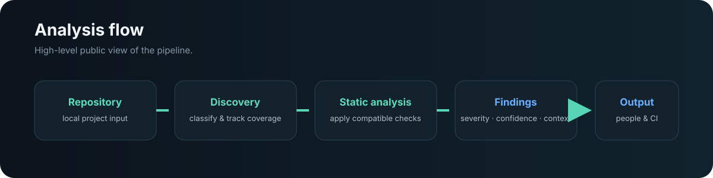
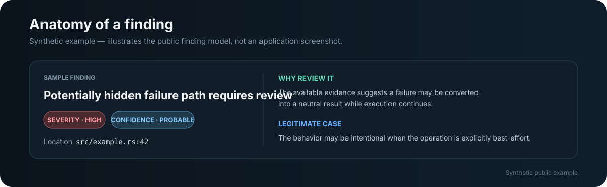

  
  
  
  
  

# RepoScope

**Explainable static repository analysis for technical review and automation.**

RepoScope inspects local software repositories, surfaces review-worthy signals and makes analysis coverage explicit. It is designed as a repeatable first pass over mixed codebases without executing the target project in its normal static mode.

> **Public showcase:** source code, binaries, detailed checks, heuristics and private test corpora are not published in this repository.

## Highlights

| Capability | Current public view |
|---|---|
| Coverage | **26** documented language and file families |
| Checks | **147** registered checks in the current reviewed build |
| Results | Severity, confidence, location and review context |
| Outputs | Terminal, JSON, JSONL, Markdown and SARIF |
| Git workflows | Full scan, changed files, diff and baseline workflows |
| Core | Rust with structural parsing for selected languages |

## How it works

`Repository → Discovery → Static analysis → Classified findings → Review / automation`

RepoScope tracks what was analyzed and what could not be fully processed instead of silently presenting incomplete coverage as a complete result.

## What it can surface

The current analyzer covers review domains such as code quality, maintainability, hidden failure patterns, fallback behavior, configuration inconsistencies, import/dependency issues, disconnected code signals, incomplete implementations and repository hygiene.

The exact catalog and detection strategies are intentionally kept private.

## Analysis model

Not every language receives the same depth of analysis. Where supported, RepoScope combines contextual checks with structural parsing and selected information about imports, symbols and calls. Missing deeper capabilities are reported as limitations rather than silently replaced by weaker analysis.

**Severity and confidence are separate:** a potentially important signal may still require manual confirmation.

### A finding is more than an alert

The illustration above is a synthetic public example, not a screenshot of a graphical interface. It shows the information model used to make results easier to review: impact, confidence, location, context and guidance for legitimate cases.

## Workflows and output

RepoScope supports full repository scans, change-focused analysis, Git comparisons, baselines, justified suppressions, content-aware cache, benchmark and diagnostic workflows.

Reports can be produced for people or tooling through **Terminal, Markdown, JSON, JSONL and SARIF**.

## Design principles

- **Static by default:** normal analysis does not run builds, tests or scripts from the target repository.
- **Explicit coverage:** files or phases that cannot be analyzed remain visible in the result.
- **Explainable findings:** results carry context instead of acting as unexplained alerts.
- **Deterministic output:** equivalent runs are designed to remain comparable.
- **No silent downgrade:** unavailable deeper analysis is reported as a limitation.

## Current status

**Functional command-line analyzer under active development.** Analysis depth and signal quality continue to evolve across supported languages and project types.

There is currently no graphical dashboard or hosted service, and dynamic execution of the analyzed project is not an available feature.

## Technology

**Rust · Tree-sitter · Git context · SARIF · JSON · JSONL · Markdown**

## Repository scope

This repository exists to document RepoScope and show its capabilities. The implementation, detailed rules, internal architecture, proprietary corpora and reports from private projects remain private.

---

RepoScope — explainable static repository analysis.

